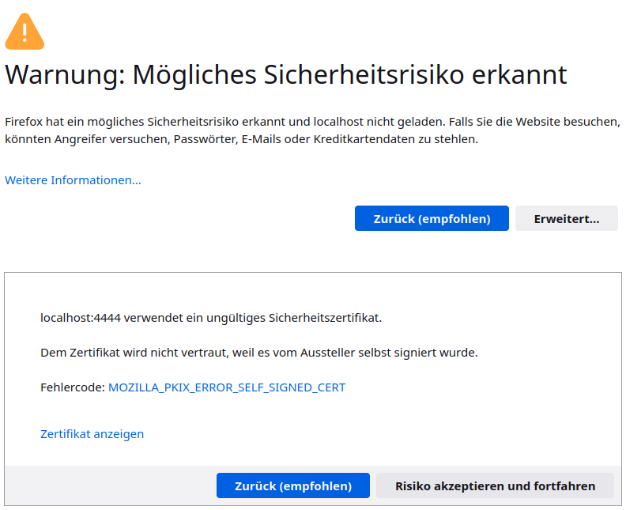
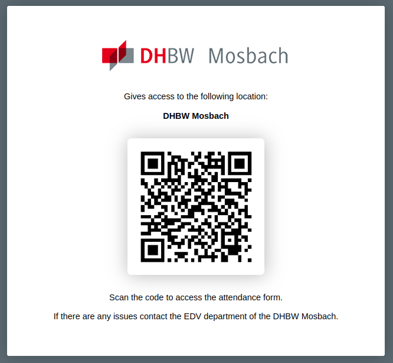
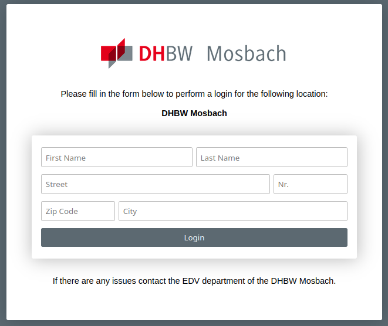

# dhbw-attendancelist

An attendance list application based on qr codes written in Go.

## Disclaimer

This repository is only for educational purposes and should not be used in any
productive scenarios.

It is not under active development.

## Requirements

This project requires a fully working Go installation (Version 1.12+).

## Quickstart

Clone the repository with the following command:
```sh
git clone https://github.com/dateiexplorer/dhbw-attendancelist.git
```

To build the executables `cd` in the root directory of this repository and
execute the `build` command.

```sh
cd dhwb-attendancelist
go build -o ./build/ ./...
```
This command creates a `build` direcotry and stores to executables in it.
Now you can execute this executables, e.g.

```sh
./build/service \
    -locations ./assets/locations.xml \
    -cert ./assets/cert.pem --key ./assets/key.pem
```

Note that the files in the `assets` directory are sample files for local
deployment. Never use the HTTPS certificates in a productive environment.
Instead create them on your own.

Note: You can change the behaviour of the web server with additional flags.

Now you running a web server. If you use the default ports you can navigate
to `https://localhost:4443/` to see all available locations (parsed from the
locations.xml).

Note that the SSL certificate is self-signed so you'll get a potential security
risk warning like the following:



If you deploy the web server on your local machine you can accept the warning
and continue.

Now you can choose a location and get the corresponding QR code like the
following:



You can scan this QR-Code to access to Login site for this location.
Alternativly you can get a access token through the API endpoint (default is
`https://localhost:4443/api/tokens`).
Here you see all vaild tokens.
You can also get only the current valid token for a specific location by
typing: `https://localhost:4443/api/tokens?location=<location>`.

Use this tokens to access the Login page for a specific location under
`https://localhost:4444?token=<token>`

Now you can login with your credentials.



To get information about the attendance of users, use the `analyzer` CLI-tool.

If you want to get more information about specific commands read the full
[documentation](docs/Documentation_de.pdf) (in German)
